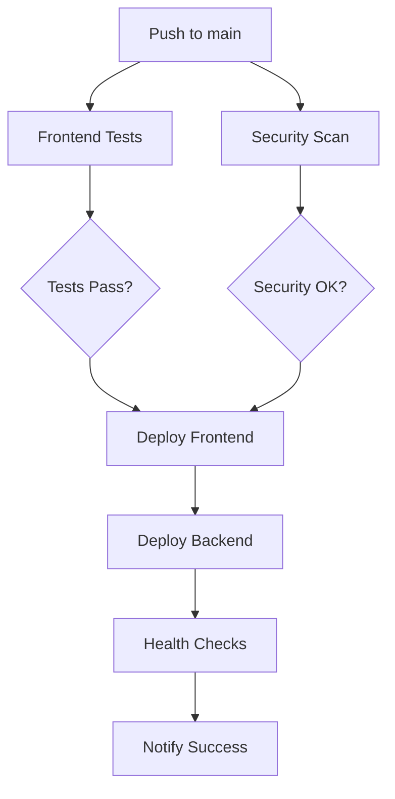

# GitHub Actions Workflows

This directory contains automated CI/CD workflows for the Personal Portfolio project.

## Workflows Overview

### 🔄 ci.yml - Main CI/CD Pipeline
**Triggers**: Push to main/develop, Pull Requests
- **Frontend Testing**: Linting, type checking, tests with coverage
- **Security Scanning**: Trivy vulnerability scanner
- **Performance**: Lighthouse audits on PRs
- **Deployment**: Automated deployment to Vercel (frontend) and Fly.io (backend)
- **Quality Gates**: All tests must pass before deployment

### 🚀 release.yml - Release Management
**Triggers**: Git tags (v*), Manual workflow dispatch
- **Release Creation**: Automated GitHub releases with changelogs
- **Production Deployment**: Deploy to production with health checks
- **Stakeholder Notifications**: Automated issue comments and notifications

### 🔒 security-scan.yml - Security & Compliance
**Triggers**: Weekly schedule, Dependency changes, Manual dispatch
- **Dependency Scanning**: NPM audit and Snyk integration
- **Secret Detection**: GitLeaks scan for exposed secrets
- **License Compliance**: Automated license compatibility checks
- **Security Reports**: Weekly security status reports

### 📊 monitoring.yml - Production Monitoring
**Triggers**: Every 15 minutes, Deployment events, Manual dispatch
- **Health Checks**: Frontend, backend, and WebSocket monitoring
- **SSL Monitoring**: Certificate expiration tracking
- **Performance Monitoring**: Response time alerts
- **Incident Management**: Automatic issue creation on failures
- **Uptime Reports**: Weekly uptime summaries

### 🔍 codeql.yml - Code Analysis
**Triggers**: Push, Pull Requests, Weekly schedule
- **Static Analysis**: CodeQL security analysis
- **Vulnerability Detection**: Language-specific security scans

## Required Secrets

Add these secrets in your GitHub repository settings:

### Deployment
- `VERCEL_TOKEN` - Vercel deployment token
- `VERCEL_ORG_ID` - Vercel organization ID
- `VERCEL_PROJECT_ID` - Vercel project ID
- `FLY_API_TOKEN` - Fly.io deployment token

### Monitoring & Security
- `CODECOV_TOKEN` - Code coverage reporting
- `SNYK_TOKEN` - Snyk security scanning (optional)
- `GITLEAKS_LICENSE` - GitLeaks license (optional)

## Environment Variables

Set these in your Vercel deployment and local environment:

```env
# Core functionality
RESEND_API_KEY=your-resend-api-key
FROM_EMAIL=noreply@yourdomain.com
TO_EMAIL=your-email@gmail.com
GEMINI_API_KEY=your-gemini-api-key

# Real-time features
NEXT_PUBLIC_PYTHON_WS_URL=wss://events-backend.fly.dev/ws/github-events
```

## Workflow Features

### ✅ Quality Gates
- All PRs require passing tests
- Security scans must pass
- Lighthouse performance thresholds
- TypeScript type checking
- ESLint code quality

### 🔄 Automated Processes
- Dependency updates via Dependabot
- Security vulnerability alerts
- Automated deployments on merge
- Performance regression detection
- SSL certificate monitoring

### 📈 Monitoring & Alerts
- 15-minute health check intervals
- Automatic incident creation
- Performance threshold alerts
- Weekly uptime reports
- Deployment status notifications

## Deployment Flow



## Maintenance

### Weekly Tasks (Automated)
- Security scans
- Uptime reports
- Dependency reviews

### Monthly Tasks (Manual)
- Review and update workflow versions
- Check for new security scanning tools
- Review monitoring thresholds
- Update documentation

### Quarterly Tasks (Manual)
- Audit deployment processes
- Review and update secrets rotation
- Performance baseline updates
- Disaster recovery testing

## Troubleshooting

### Common Issues

1. **Deployment Failures**
   - Check secrets are properly set
   - Verify environment variables
   - Review build logs in workflow runs

2. **Security Scan Failures**
   - Update vulnerable dependencies
   - Review and address security findings
   - Check if scans are false positives

3. **Monitoring Alerts**
   - Check service health manually
   - Review recent deployments
   - Verify external service dependencies

### Getting Help

1. Check workflow run logs in GitHub Actions tab
2. Review the specific workflow file for configuration
3. Check repository issues for known problems
4. Verify all required secrets are configured

## Contributing

When modifying workflows:

1. Test changes in a feature branch first
2. Use workflow_dispatch for manual testing
3. Update this documentation
4. Consider impact on existing deployments
5. Follow security best practices