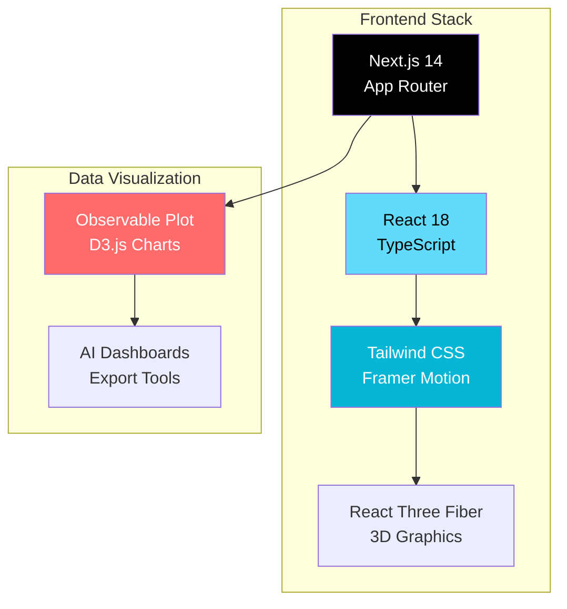
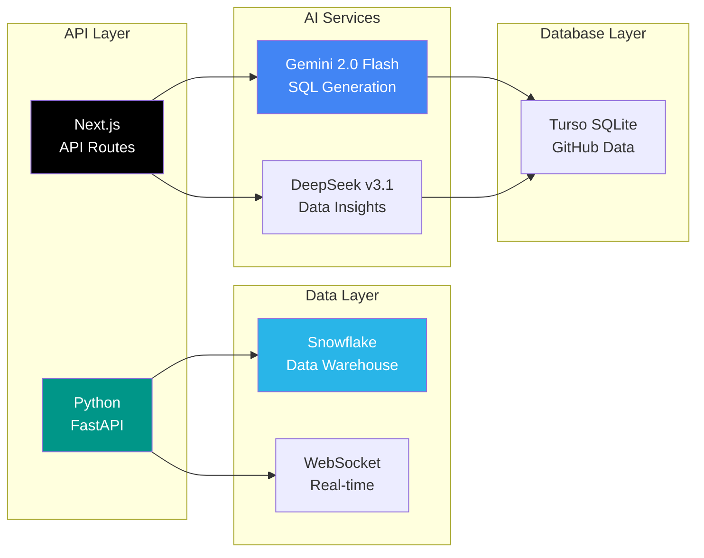
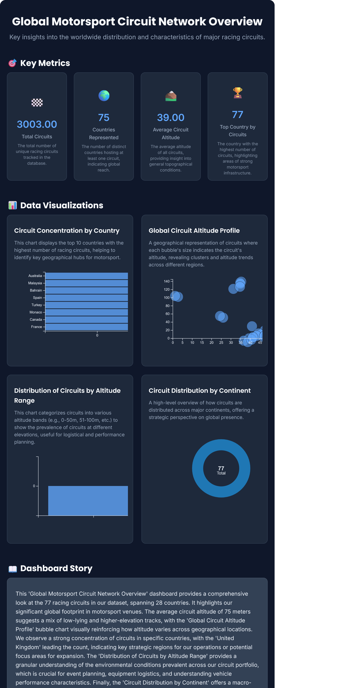

# 🚀 Interactive Developer Portfolio

<div align="center">

[](https://idabaguspurwa.com)
[](https://github.com/idabaguspurwa/interactive-portfolio/actions/workflows/ci.yml)
[](https://github.com/idabaguspurwa/interactive-portfolio/actions/workflows/codeql.yml)

[](https://nextjs.org/)
[](https://www.typescriptlang.org/)
[](https://python.org/)
[](https://fastapi.tiangolo.com/)
[](https://snowflake.com/)

[](https://vercel.com)
[](https://fly.io)
[](https://opensource.org/licenses/MIT)

</div>

---

**A cutting-edge, AI-powered portfolio showcasing advanced full-stack development with real-time data processing, enterprise visualizations, and modern web technologies.**

> 🎯 **Experience live data engineering pipelines, AI-driven analytics, and interactive 3D visualizations in a single, cohesive platform.**

## ✨ Key Features

<table>
<tr>
<td width="50%">

### 🤖 AI-Powered Analytics
- **AI Data Explorer** - Natural language queries for GitHub repository data
- **Dual AI Architecture** - Gemini 2.0 Flash + DeepSeek for SQL generation and insights
- **Smart CSV Analysis** - Upload any dataset for instant AI insights
- **Auto Dashboard Generation** - Professional visualizations in seconds
- **Export Capabilities** - High-quality PNG and HTML exports

### 🏗️ Enterprise Data Pipeline
- **Bronze → Silver → Gold** ETL workflow simulation
- **Real-time Progress Tracking** - Watch data transformation live
- **Snowflake Integration** - Production-grade data warehouse
- **Apache Spark Concepts** - Industry-standard processing patterns

</td>
<td width="50%">

### 📊 Live GitHub Analytics
- **Real-time Dashboard** - Live GitHub activity monitoring 
- **Enterprise Visualizations** - Tableau-like interactive charts
- **WebSocket Streaming** - Sub-second data updates
- **Cross-filtering** - Advanced dashboard interactions

### 🎨 Modern Web Experience
- **Next.js 14** - Latest App Router and React 18
- **3D Graphics** - React Three Fiber interactive elements
- **Framer Motion** - Physics-based smooth animations
- **Performance Optimized** - SSR, lazy loading, WebGL management

</td>
</tr>
</table>

## 🎮 Interactive Data Playground

The playground provides a unified interface for exploring data engineering concepts with three main sections:

### AI Data Explorer Tab ⭐ **NEW**
- **Natural Language Queries**: Ask questions about GitHub data in plain English
- **Dual AI System**: Gemini 2.0 Flash generates SQL, DeepSeek provides intelligent insights
- **Live GitHub Database**: Real repository data via Turso Edge SQLite with weekly sync
- **Smart Visualizations**: Automatic charts and tables based on query results
- **Multi-layer Reliability**: AI → Template fallbacks → Analytical insights for 99% uptime
- **Enterprise Security**: SQL injection prevention and read-only query validation

### Data Lakehouse Tab
- **Interactive ETL Pipeline**: Bronze → Silver → Gold data transformation workflow
- **Real Data Processing**: Upload CSV files or use sample datasets
- **Live ETL Pipeline**: Watch data flow through Extract, Transform, and Load stages
- **Performance Metrics**: Monitor processing speed, success rates, and data quality
- **Apache Spark Simulation**: Experience data processing concepts in action

### GitHub Events Tab
- **Live Production Data**: Real-time connection to Snowflake database
- **Integrated Dashboard**: GitHub Events data displayed directly in the tab
- **Production Pipeline**: Completed GitHub Events data pipeline with real repository activity
- **Advanced Analytics**: Complex aggregations, timeline analysis, and repository insights
- **No Navigation Required**: See live data immediately when switching tabs

### Performance Optimizations
- **Instant Loading**: Playground main page loads without backend dependencies
- **Isolated Cold Starts**: Only GitHub Events tab waits for Python backend warmup
- **Dynamic Rendering**: Optimized for Vercel deployment with proper build configuration
- **Efficient Component Loading**: Lazy loading with proper loading states

## 🏗️ Architecture & Technology Stack

<div align="center">

### 🎨 Frontend Architecture



### ⚙️ Backend & Data Pipeline



</div>

### 🚀 Technology Stack Overview

| Layer | Technologies | Purpose |
|-------|--------------|----------|
| **Frontend** | Next.js 14, React 18, TypeScript | Modern web application with SSR/SSG |
| **Styling** | Tailwind CSS, Framer Motion | Responsive design and smooth animations |
| **3D Graphics** | React Three Fiber, Three.js | Interactive 3D experiences |
| **Backend API** | Python FastAPI, Next.js API Routes | High-performance data processing |
| **Database** | Snowflake Data Warehouse, Turso SQLite | Enterprise + Edge database solutions |
| **AI/ML** | Gemini 2.0 Flash + DeepSeek v3.1 | Dual AI for SQL generation and insights |
| **Visualization** | Observable Plot, D3.js | Professional data visualizations |
| **Real-time** | WebSocket, React Query | Live data streaming and caching |
| **Deployment** | Vercel, Fly.io | Global CDN and scalable infrastructure |
| **DevOps** | GitHub Actions, CodeQL | Automated CI/CD and security scanning |

## 🏆 What Sets This Portfolio Apart

<div align="center">

### 🎯 **Beyond Traditional Portfolios**

</div>

<table>
<tr>
<th width="25%">Capability</th>
<th width="25%">Static Portfolio</th>
<th width="25%">Traditional SPA</th>
<th width="25%"><strong>This Portfolio</strong></th>
</tr>
<tr>
<td><strong>🤖 AI Integration</strong></td>
<td>❌ None</td>
<td>⚠️ Basic chatbots</td>
<td>✅ <strong>Full AI data analysis</strong></td>
</tr>
<tr>
<td><strong>📊 Data Processing</strong></td>
<td>❌ Static displays</td>
<td>⚠️ Simple charts</td>
<td>✅ <strong>Real ETL pipelines</strong></td>
</tr>
<tr>
<td><strong>🏗️ Enterprise Features</strong></td>
<td>❌ Contact forms</td>
<td>⚠️ Basic APIs</td>
<td>✅ <strong>Snowflake + FastAPI</strong></td>
</tr>
<tr>
<td><strong>🔄 Real-time Data</strong></td>
<td>❌ Static content</td>
<td>⚠️ Polling updates</td>
<td>✅ <strong>WebSocket streaming</strong></td>
</tr>
<tr>
<td><strong>🌍 3D Experience</strong></td>
<td>❌ Images only</td>
<td>⚠️ Basic animations</td>
<td>✅ <strong>Interactive 3D graphics</strong></td>
</tr>
<tr>
<td><strong>📥 Export Capabilities</strong></td>
<td>❌ Print to PDF</td>
<td>⚠️ Screenshot tools</td>
<td>✅ <strong>Professional PNG/HTML</strong></td>
</tr>
</table>

### 🎖️ **Key Differentiators**

- **🚀 Production-Ready**: Real enterprise tools, not just demos
- **🤖 AI-First Approach**: Intelligent analysis, not just integration  
- **📊 Live Data Processing**: Actual pipelines, not simulated ones
- **🎨 Modern UX**: Smooth animations with performance optimization
- **🔒 Enterprise Security**: CodeQL scanning and automated testing

## 📦 Installation

### Prerequisites

- Node.js 18+ and npm/yarn
- Python 3.9+ (for backend development)
- Git

### Clone Repository

```bash
git clone https://github.com/idabaguspurwa/interactive-portfolio.git
cd interactive-portfolio
```

### Install Dependencies

```bash
# Install Node.js dependencies
npm install

# Install Python dependencies (for backend)
cd python-backend
pip install -r requirements.txt
cd ..
```

### Environment Variables

Create a `.env.local` file in the root directory:

```env
# Resend Configuration (for contact form)
RESEND_API_KEY=your-resend-api-key
FROM_EMAIL=noreply@yourdomain.com
TO_EMAIL=your-email@gmail.com

# AI Data Explorer - Dual AI System
GEMINI_API_KEY=your-gemini-api-key          # For SQL generation
OPENROUTER_API_KEY=your-openrouter-api-key  # For DeepSeek insights

# Turso Database (for AI Data Explorer)
TURSO_DATABASE_URL=libsql://your-database.turso.io
TURSO_AUTH_TOKEN=your-turso-auth-token

# Optional: Analytics
NEXT_PUBLIC_GA_ID=your-ga-id
```

Create a `.env` file in the `python-backend` directory:

```env
# Snowflake Configuration
SNOWFLAKE_ACCOUNT=your_snowflake_account
SNOWFLAKE_USERNAME=your_snowflake_username
SNOWFLAKE_PASSWORD=your_snowflake_password
SNOWFLAKE_DATABASE=your_database_name
SNOWFLAKE_SCHEMA=your_schema_name
SNOWFLAKE_WAREHOUSE=your_warehouse_name
```

### Development Server

```bash
# Start Next.js development server
npm run dev

# Start Python FastAPI server (in another terminal)
cd python-backend
uvicorn main:app --host 0.0.0.0 --port 8000 --reload

# The app will be available at http://localhost:3000
# The API will be available at http://localhost:8000
```

## ⚡ Quick Start Guide

<div align="center">

**Transform your data into professional dashboards in under 5 minutes!**

[](https://idabaguspurwa.com/playground)

</div>

### 💻 **Local Development Setup**

```bash
# 1️⃣ Clone the repository
git clone https://github.com/idabaguspurwa/interactive-portfolio.git
cd interactive-portfolio

# 2️⃣ Install dependencies
npm install

# 3️⃣ Set up environment variables
cp .env.example .env.local
# Add your API keys (see Environment section below)

# 4️⃣ Start development server
npm run dev
# 🌐 Open http://localhost:3000
```

### 🎯 **Try the Live Demo** 

**No installation required!** Experience the full functionality:

1. **🔗 Visit [idabaguspurwa.com](https://idabaguspurwa.com)**
2. **🎮 Navigate to Playground**
3. **📋 Upload any CSV file** (sales, analytics, etc.)
4. **🤖 Watch AI analysis** in real-time
5. **📊 Generate dashboard** automatically
6. **📥 Export as PNG/HTML**

> **✨ Pro Tip**: Try the GitHub Events tab to see live data streaming from Snowflake!

### 🔑 **Environment Configuration**

```env
# AI Data Explorer (NEW!)
GEMINI_API_KEY=your-gemini-api-key          # Gemini 2.0 Flash for SQL generation
OPENROUTER_API_KEY=your-openrouter-api-key  # DeepSeek for intelligent insights
TURSO_DATABASE_URL=libsql://your-db.turso.io # Live GitHub data
TURSO_AUTH_TOKEN=your-turso-auth-token       # Database authentication

# Core Features
RESEND_API_KEY=your-resend-api-key          # For contact form
FROM_EMAIL=noreply@yourdomain.com
TO_EMAIL=your-email@gmail.com

# Optional: Analytics
NEXT_PUBLIC_GA_ID=your-ga-id
```

## 📸 Visual Showcase

<div align="center">

### 🤖 **AI-Powered Dashboard Generation**



**✨ From CSV to Dashboard in Seconds ✨**

*Upload any dataset → AI analysis → Professional visualization → Export ready*

---

### 🎬 **Feature Highlights**

<table>
<tr>
<td width="50%" align="center">

**🚀 Live ETL Pipeline**


*Watch data transformation in real-time with progress indicators and performance metrics*

</td>
<td width="50%" align="center">

**📊 Real-time Analytics** 


*Snowflake-powered dashboard with WebSocket streaming and interactive charts*

</td>
</tr>
<tr>
<td width="50%" align="center">

**🎨 3D Interactive Elements**


*Smooth animations with WebGL optimization and performance monitoring*

</td>
<td width="50%" align="center">

**📥 Professional Exports**


*High-quality exports with full background coverage for presentations*

</td>
</tr>
</table>

</div>

### 🔧 **Full Stack Development**

```bash
# Terminal 1: Frontend Development Server
npm run dev
# → Next.js app at http://localhost:3000

# Terminal 2: Python Backend (Optional - for local GitHub Events)
cd python-backend
uvicorn main:app --host 0.0.0.0 --port 8000 --reload
# → FastAPI server at http://localhost:8000

# Terminal 3: Run Full CI Pipeline
npm run ci
# → Linting, type-checking, testing, and building
```

## 🔧 Troubleshooting

### Common Issues & Solutions

#### **CSV Upload & Data Processing**

| Issue | Root Cause | Solution | Prevention |
|-------|------------|----------|------------|
| **File not uploading** | File size > 10MB or wrong format | Compress CSV or split into smaller files | Use CSV validation before upload |
| **Encoding issues** | Non-UTF-8 characters | Save CSV as UTF-8 in Excel/Google Sheets | Always export with UTF-8 encoding |
| **Empty analysis** | Missing headers or < 2 data rows | Add proper headers and sample data | Validate CSV structure before upload |
| **ETL pipeline stuck** | Memory limit exceeded | Use files < 1000 rows for demo | Implement streaming for large files |
| **Special characters broken** | Incorrect encoding detection | Convert to UTF-8 using `iconv` or similar | Standardize data sources |

#### **AI Analysis & Dashboard Generation**

| Issue | Root Cause | Solution | Prevention |
|-------|------------|----------|------------|
| **Analysis timeout** | Gemini API rate limits | Wait 60 seconds and retry | Implement exponential backoff |
| **No insights generated** | CSV lacks numeric/categorical data | Ensure mixed data types in CSV | Pre-validate data variety |
| **Dashboard export fails** | Charts not fully rendered | Wait for loading indicators to disappear | Add render completion checks |
| **PNG background transparent** | CSS styling not captured | Use "Download with Background" button | Implement proper background export |
| **Export quality poor** | Default 1x scaling | Use 2x or 3x scale option | Set high DPI export settings |
| **API quota exceeded** | Too many requests | Switch to Gemini 1.5 Flash fallback | Monitor API usage dashboard |

#### **Real-time Data & WebSocket Issues**

| Issue | Root Cause | Solution | Prevention |
|-------|------------|----------|------------|
| **GitHub Events not loading** | Python backend cold start | Wait 30-60 seconds for warmup | Implement health check pings |
| **WebSocket connection failed** | CORS or network issues | Check browser console for errors | Verify WebSocket URL configuration |
| **Data not updating** | Connection dropped | Refresh page to reconnect | Implement auto-reconnection logic |
| **403 Forbidden error** | Wrong WebSocket endpoint | Verify `/ws/github-events` path | Use correct WebSocket URL pattern |
| **Connection timeouts** | Fly.io app sleeping | Make HTTP request to wake backend | Implement keep-alive mechanism |

#### **Development & Build Issues**

| Issue | Root Cause | Solution | Prevention |
|-------|------------|----------|------------|
| **Build failures** | Missing dependencies | `rm -rf node_modules && npm install` | Lock dependency versions |
| **TypeScript errors** | Type mismatches | Run `npm run type-check` | Enable strict TypeScript |
| **ESLint warnings** | Code style issues | Run `npm run lint:fix` | Use pre-commit hooks |
| **3D graphics not rendering** | WebGL context lost | Refresh page, check GPU drivers | Implement WebGL error handling |
| **Memory leaks** | Event listeners not cleaned | Check useEffect cleanup | Use proper component lifecycle |
| **Hot reload broken** | Next.js cache issues | Delete `.next` folder and restart | Clear cache regularly |

#### **Production Deployment Issues**

| Issue | Root Cause | Solution | Prevention |
|-------|------------|----------|------------|
| **Vercel build timeout** | Large bundle size | Optimize images and dependencies | Monitor bundle analyzer |
| **API routes failing** | Environment variables missing | Check Vercel environment settings | Use environment validation |
| **Fly.io app not responding** | Resource limits exceeded | Scale up instance or optimize queries | Monitor resource usage |
| **WebSocket CORS errors** | Origin not allowed | Configure CORS in FastAPI backend | Whitelist production domains |
| **Static assets 404** | Incorrect public paths | Use Next.js Image optimization | Test asset paths in build |

### Advanced Debugging Techniques

#### **Browser DevTools Workflow**
```bash
# 1. Open Chrome/Firefox DevTools (F12)
# 2. Check Console for errors
# 3. Network tab → Filter by XHR/Fetch to see API calls
# 4. Performance tab → Record page load for bottlenecks
# 5. Application tab → Local Storage/IndexedDB for cached data
```

#### **Backend API Testing**
```bash
# Test Python backend health
curl -X GET "https://your-app.fly.dev/health"

# Test GitHub events endpoint
curl -X GET "https://your-app.fly.dev/github-events"

# Test WebSocket connection
wscat -c "wss://your-app.fly.dev/ws/github-events"
```

#### **Local Development Debug Mode**
```bash
# Enable verbose logging
DEBUG=* npm run dev

# Run TypeScript compiler in watch mode
npx tsc --watch --noEmit

# Monitor bundle size changes
npm run analyze

# Test API routes individually
curl -X POST "http://localhost:3000/api/analyze-csv" \
  -H "Content-Type: application/json" \
  -d '{"csvData": "name,age\nJohn,30"}'
```

### Performance Monitoring Commands

```bash
# Check memory usage during development
node --inspect-brk=9229 node_modules/.bin/next dev

# Bundle size analysis
ANALYZE=true npm run build

# Lighthouse performance audit
npx lighthouse http://localhost:3000 --output=json

# Python backend performance
cd python-backend && python -m cProfile -o profile.stats main.py
```

### Getting Help

| Problem Type | Best Resource | Response Time |
|--------------|---------------|---------------|
| **Bug Reports** | [GitHub Issues](https://github.com/idabaguspurwa/interactive-portfolio/issues) | 24-48 hours |
| **Feature Requests** | GitHub Discussions | 1-7 days |
| **Performance Issues** | Chrome DevTools + GitHub Issues | 24 hours |
| **API Integration** | FastAPI documentation + OpenAPI schema | Same day |
| **Deployment Issues** | Vercel/Fly.io documentation + GitHub Issues | 24 hours |

### Error Code Reference

| Code | Description | Action Required |
|------|-------------|-----------------|
| `CSV_VALIDATION_ERROR` | Invalid CSV format/structure | Fix CSV headers and data types |
| `AI_QUOTA_EXCEEDED` | Gemini API limits reached | Wait or upgrade API plan |
| `WEBSOCKET_CONNECTION_FAILED` | Real-time connection dropped | Check network and retry |
| `EXPORT_RENDERING_ERROR` | Dashboard export failed | Wait for full render completion |
| `BACKEND_COLD_START` | Python backend warming up | Wait 30-60 seconds |

## 🔒 Security Best Practices

### Environment Variable Security

#### **Secure Environment Management**
```bash
# ✅ Good: Use environment-specific files
.env.local          # Local development (git-ignored)
.env.production     # Production secrets (git-ignored)
.env.example        # Template with dummy values (git-tracked)

# ❌ Bad: Committing secrets
.env               # Never commit this to git
```

#### **API Key Security**
```typescript
// ✅ Good: Server-side only sensitive keys
// These keys should NEVER be prefixed with NEXT_PUBLIC_
const GEMINI_API_KEY = process.env.GEMINI_API_KEY        // Server-only
const RESEND_API_KEY = process.env.RESEND_API_KEY        // Server-only
const SNOWFLAKE_PASSWORD = process.env.SNOWFLAKE_PASSWORD // Server-only

// ✅ Good: Public keys (safe for client-side)
const GA_ID = process.env.NEXT_PUBLIC_GA_ID              // Public analytics
const WEBSOCKET_URL = process.env.NEXT_PUBLIC_PYTHON_WS_URL // Public endpoint

// ❌ Bad: Exposing sensitive data
const API_KEY = process.env.NEXT_PUBLIC_GEMINI_API_KEY   // ⚠️ EXPOSED TO CLIENT!
```

### Input Validation & Sanitization

#### **CSV Upload Security**
```typescript
// File size limits
const MAX_FILE_SIZE = 10 * 1024 * 1024; // 10MB limit

// Content type validation
const ALLOWED_TYPES = ['text/csv', 'application/csv'];

// Filename sanitization
const sanitizeFilename = (filename) => {
  return filename.replace(/[^a-zA-Z0-9.-]/g, '_').substring(0, 100);
};

// CSV injection prevention
const preventCSVInjection = (csvContent) => {
  return csvContent.replace(/^[=+\-@]/gm, "'$&");
};
```

#### **API Route Security**
```typescript
// Rate limiting implementation
const rateLimit = {
  '/api/ai-dashboard': { requests: 10, window: '1m' },
  '/api/contact': { requests: 5, window: '1m' },
  '/api/analyze-csv': { requests: 15, window: '5m' }
};

// Input validation
const validateCSVInput = (data) => {
  if (!data || typeof data !== 'string') return false;
  if (data.length > 10_000_000) return false; // 10MB string limit
  return true;
};
```

### Content Security Policy (CSP)

#### **Next.js CSP Implementation**
```javascript
// next.config.js security headers
const securityHeaders = [
  {
    key: 'Content-Security-Policy',
    value: [
      "default-src 'self'",
      "script-src 'self' 'unsafe-eval' 'unsafe-inline' https://www.googletagmanager.com",
      "style-src 'self' 'unsafe-inline' https://fonts.googleapis.com",
      "font-src 'self' https://fonts.gstatic.com",
      "img-src 'self' data: https:",
      "connect-src 'self' https://api.gemini.com wss://*.fly.dev",
      "frame-ancestors 'none'",
      "base-uri 'self'"
    ].join('; ')
  },
  {
    key: 'X-Frame-Options',
    value: 'DENY'
  },
  {
    key: 'X-Content-Type-Options', 
    value: 'nosniff'
  },
  {
    key: 'Referrer-Policy',
    value: 'strict-origin-when-cross-origin'
  }
];
```

### Authentication & Authorization

#### **API Route Protection**
```typescript
// Middleware for sensitive endpoints
export async function middleware(request) {
  const { pathname } = request.nextUrl;
  
  // Rate limiting
  const ip = request.ip ?? '127.0.0.1';
  const rateLimitKey = `${ip}:${pathname}`;
  
  // CORS validation
  const origin = request.headers.get('origin');
  if (origin && !ALLOWED_ORIGINS.includes(origin)) {
    return new Response('Forbidden', { status: 403 });
  }
  
  return NextResponse.next();
}

// Matcher for protected routes
export const config = {
  matcher: ['/api/((?!health|_next/static|favicon.ico).*)']
};
```

### Data Privacy & GDPR Compliance

#### **Data Handling Practices**
```typescript
// ✅ Good: Minimal data collection
const contactFormData = {
  name: sanitize(name),
  email: validateEmail(email),
  message: sanitize(message),
  timestamp: new Date().toISOString(),
  // No IP collection, no tracking cookies
};

// ✅ Good: Data retention policy
const DATA_RETENTION_DAYS = 30;
const cleanupOldData = () => {
  // Remove contact form submissions older than 30 days
};

// ✅ Good: Explicit consent
const GDPR_NOTICE = "By submitting this form, you consent to data processing for contact purposes only.";
```

### Backend Security (Python FastAPI)

#### **Snowflake Connection Security**
```python
# Environment-based configuration
SNOWFLAKE_CONFIG = {
    "account": os.environ["SNOWFLAKE_ACCOUNT"],
    "user": os.environ["SNOWFLAKE_USERNAME"], 
    "password": os.environ["SNOWFLAKE_PASSWORD"],
    "warehouse": os.environ["SNOWFLAKE_WAREHOUSE"],
    "database": os.environ["SNOWFLAKE_DATABASE"],
    "schema": os.environ["SNOWFLAKE_SCHEMA"],
    "client_session_keep_alive": True,
    "login_timeout": 10,
    "network_timeout": 30
}

# Connection pool with limits
snowflake_pool = ConnectionPool(
    max_connections=5,
    connection_timeout=30,
    **SNOWFLAKE_CONFIG
)
```

#### **CORS Configuration**
```python
# FastAPI CORS setup
app.add_middleware(
    CORSMiddleware,
    allow_origins=[
        "https://idabaguspurwa.com",
        "https://*.vercel.app",
        "http://localhost:3000"  # Development only
    ],
    allow_credentials=False,  # No cookies needed
    allow_methods=["GET", "POST"],
    allow_headers=["*"],
    max_age=3600
)
```

### Security Monitoring & Alerting

#### **Automated Security Scans**
```bash
# npm audit for vulnerabilities
npm audit --audit-level high

# CodeQL security scanning (GitHub Actions)
# Runs automatically on PR and weekly

# Dependency vulnerability scanning
npx audit-ci --high --config ./audit-ci.json

# OWASP ZAP security testing
docker run -t owasp/zap2docker-stable zap-baseline.py \
  -t https://idabaguspurwa.com
```

#### **Runtime Security Monitoring**
```typescript
// Error boundary with security logging
export class SecurityErrorBoundary extends React.Component {
  componentDidCatch(error, errorInfo) {
    // Log security-relevant errors (without sensitive data)
    if (error.message.includes('XSS') || error.message.includes('injection')) {
      console.error('Security Error:', {
        message: error.message,
        timestamp: new Date().toISOString(),
        userAgent: navigator.userAgent
      });
    }
  }
}
```

### Deployment Security

#### **Vercel Security Configuration**
```json
{
  "headers": [
    {
      "source": "/(.*)",
      "headers": [
        {
          "key": "X-Frame-Options",
          "value": "DENY"
        },
        {
          "key": "X-Content-Type-Options", 
          "value": "nosniff"
        },
        {
          "key": "Strict-Transport-Security",
          "value": "max-age=63072000; includeSubDomains; preload"
        }
      ]
    }
  ]
}
```

#### **Fly.io Security Configuration**
```toml
# fly.toml security settings
[env]
  LOG_LEVEL = "info"
  TRUST_PROXY = "true"

[http_service]
  force_https = true
  auto_stop_machines = true
  auto_start_machines = true
  
[[http_service.checks]]
  grace_period = "10s"
  interval = "30s"
  method = "GET"
  timeout = "5s"
  path = "/health"
```

### Security Checklist

#### **Pre-deployment Security Audit**

- ✅ **Environment Variables**: No secrets in git, proper .env files
- ✅ **Input Validation**: All user inputs sanitized and validated
- ✅ **Rate Limiting**: API endpoints protected against abuse
- ✅ **CORS Configuration**: Only allow trusted origins
- ✅ **CSP Headers**: Content Security Policy implemented
- ✅ **HTTPS Enforcement**: All traffic encrypted in production
- ✅ **Dependency Scanning**: Regular npm audit and updates
- ✅ **Error Handling**: No sensitive data in error messages
- ✅ **File Upload Security**: Size limits and type validation
- ✅ **Database Security**: Parameterized queries, connection pooling

#### **Ongoing Security Practices**

- 📅 **Weekly**: Automated security scans via GitHub Actions
- 📅 **Monthly**: Manual security review and dependency updates
- 📅 **Quarterly**: Full security audit and penetration testing
- 🚨 **On-demand**: Security patches for critical vulnerabilities

## 🔄 CI/CD Pipeline

### Automated Workflows

1. **CI Pipeline** (`.github/workflows/ci.yml`):

   - ✅ **Multi-Node Testing**: Tests on Node.js 18.x and 20.x
   - 🔍 **Code Quality**: ESLint, TypeScript checking  
   - 🏗️ **Build Verification**: Ensures successful builds
   - 🛡️ **Security Audit**: npm audit for vulnerabilities
   - 💡 **Lighthouse CI**: Performance testing on PRs
2. **Security Analysis** (`.github/workflows/codeql.yml`):

   - 🔒 **CodeQL Scanning**: Automated security vulnerability detection
   - 📅 **Scheduled Scans**: Weekly security audits
   - 🚨 **Pull Request Analysis**: Security checks on every PR

### Local CI Commands

```bash
# Run full CI pipeline locally
npm run ci

# Individual checks
npm run lint          # ESLint checking
npm run type-check     # TypeScript validation
npm run test          # Run tests
npm run build         # Production build
```

### Setting Up CI/CD

1. **Fork/Clone** the repository
2. **Enable GitHub Actions** in your repository settings
3. **Set Repository Secrets** in GitHub:
   - `GEMINI_API_KEY`
   - Other environment variables as needed

The pipeline automatically runs on:

- 🔄 Push to `main` and `develop` branches
- 📝 Pull requests to `main`
- 📅 Weekly scheduled security scans

## 🚀 Deployment

### Deploy to Vercel (Frontend)

1. **Connect to Vercel**:

   ```bash
   npm install -g vercel
   vercel login
   vercel
   ```
2. **Set Environment Variables**:
   In your Vercel dashboard, add the environment variables:

   - `RESEND_API_KEY`
   - `FROM_EMAIL`
   - `TO_EMAIL`
3. **Deploy**:

   ```bash
   vercel --prod
   ```
### Deploy Python Backend to Fly.io

1. **Install Fly CLI**:

   ```bash
   # Windows (PowerShell)
   iwr https://fly.io/install.ps1 -useb | iex

   # Or download from: https://fly.io/docs/hands-on/install-flyctl/
   ```
2. **Login and Launch**:

   ```bash
   cd python-backend
   fly auth login
   fly launch
   # Follow prompts, choose free tier, app name: events-backend
   ```
3. **Set Environment Variables**:

   ```bash
   fly secrets set SNOWFLAKE_ACCOUNT="your_snowflake_account"
   fly secrets set SNOWFLAKE_USERNAME="your_snowflake_username"
   fly secrets set SNOWFLAKE_PASSWORD="your_snowflake_password"
   fly secrets set SNOWFLAKE_DATABASE="your_database_name"
   fly secrets set SNOWFLAKE_SCHEMA="your_schema_name"
   fly secrets set SNOWFLAKE_WAREHOUSE="your_warehouse_name"
   ```
4. **Deploy**:

   ```bash
   fly deploy
   ```
5. **Update Frontend Configuration**:
   Once deployed, update `lib/python-api.js` with your Fly.io URL:

   ```javascript
   const PYTHON_API_BASE_URL = process.env.NODE_ENV === 'production' 
     ? 'https://events-backend.fly.dev'  // Your Fly.io URL
     : 'http://localhost:8000'
   ```
## 🎨 Customization

### Personal Information

Update the following files with your information:

- `app/page.jsx` - Hero section content
- `app/about/page.jsx` - About page content
- `app/projects/page.jsx` - Projects data
- `app/skills/page.jsx` - Skills and technologies
- `app/experience/page.jsx` - Work experience
- `app/playground/page.jsx` - Data playground customization
- `components/Footer.jsx` - Contact information

### Styling

- **Colors**: Modify `tailwind.config.js` for color scheme
- **Fonts**: Update Google Fonts imports in `app/globals.css`
- **Animations**: Customize Framer Motion variants in components

### 3D Elements

- 3D models and animations can be customized in respective page components
- Add new 3D elements using React Three Fiber components
- WebGL context management is handled automatically by `WebGLManager.jsx`
- Error boundaries provide graceful fallbacks for 3D rendering issues

### Favicon & Branding

- Custom favicon in `public/favicon.svg` with data engineering theme
- Update colors and design in the SVG file to match your brand
- PWA manifest in `public/manifest.json` for mobile app-like experience

## 📁 Project Structure

```
interactive-portfolio/
├── app/                    # Next.js App Router pages
│   ├── about/             # About page
│   ├── contact/           # Contact page
│   ├── experience/        # Work experience
│   ├── projects/          # Portfolio projects
│   ├── skills/            # Skills showcase
│   ├── playground/        # Interactive data playground
│   │   ├── page.jsx       # Main playground with integrated tabs
│   │   └── github-events/ # Dedicated GitHub events page
│   ├── ai-explorer/       # AI Data Explorer (NEW!)
│   │   └── page.jsx       # Standalone AI Data Explorer
│   ├── publications/      # Research publications
│   ├── globals.css        # Global styles & dashboard CSS
│   ├── layout.jsx         # Root layout component
│   └── page.jsx           # Homepage
├── app/api/               # Next.js API routes
│   ├── ai-sql-generator/  # AI Data Explorer - Dual AI SQL + insights (NEW!)
│   ├── sqlite-query/      # Turso database query execution (NEW!)
│   ├── ai-insights-generator/ # Standalone AI insights generation (NEW!)
│   ├── ai-dashboard/      # AI dashboard generation
│   ├── ai-clean-csv/      # AI-powered CSV cleaning
│   ├── analyze-csv/       # CSV analysis with Gemini AI
│   ├── process-csv/       # CSV processing & ETL
│   ├── contact/           # Contact form handling (Next.js API)
│   ├── github-metrics-python/    # GitHub metrics via Python backend
│   ├── github-timeline-python/   # GitHub timeline via Python backend
│   └── github-repositories-python/ # GitHub repos via Python backend
├── python-backend/        # Python FastAPI backend
│   ├── main.py            # FastAPI application
│   ├── requirements.txt   # Python dependencies
│   ├── fly.toml           # Fly.io deployment config
│   ├── Dockerfile         # Docker container config
│   ├── .dockerignore      # Docker ignore file
│   ├── runtime.txt        # Python runtime version
│   ├── venv/              # Python virtual environment
│   └── README.md          # Backend documentation
├── components/            # React components
│   ├── ui/                # UI component library
│   │   └── Button.jsx     # Reusable button component
│   ├── ai-data-explorer/  # AI Data Explorer components (NEW!)
│   │   ├── AIDataExplorer.jsx # Main AI Data Explorer interface
│   │   ├── NaturalLanguageInput.jsx # Natural language query input
│   │   ├── QueryProcessingView.jsx # Real-time AI processing display
│   │   ├── SQLGenerationDisplay.jsx # Generated SQL code viewer
│   │   ├── ResultsVisualization.jsx # Charts and tables for results
│   │   ├── AIInsights.jsx # Contextual data insights
│   │   └── QueryHistory.jsx # Previous questions and results
│   ├── DataDashboard.jsx  # AI-powered dashboard component
│   ├── InteractiveDataPlayground.jsx # CSV analysis interface
│   ├── GitHubEventsLiveDemo.jsx # GitHub events dashboard
│   ├── EnhancedContactForm.jsx # Enhanced contact form
│   ├── InteractiveSkills.jsx # Interactive skills display
│   ├── MobileOptimizations.jsx # Mobile-specific optimizations
│   ├── PerformanceOptimizer.jsx # Performance optimization utilities
│   ├── ResponsiveComponents.jsx # Responsive design utilities
│   ├── ScrollAnimations.jsx # Scroll-triggered animations
│   ├── ThemeProvider.jsx  # Theme management
│   ├── TypewriterEffect.jsx # Typewriter text effects
│   ├── WebGLManager.jsx   # WebGL context management
│   ├── PageTransition.jsx # Page transition animations
│   ├── Navbar.jsx         # Navigation component
│   └── Footer.jsx         # Footer component
├── lib/                   # Utility functions
│   ├── utils.js           # Common utility functions
│   ├── python-api.js      # Python backend API client
│   ├── turso-client.js    # Turso database client (NEW!)
│   ├── turso-db.js        # Database utilities and health checks (NEW!)
│   └── github-data-fetcher.js # GitHub data sync utilities (NEW!)
├── public/                # Static assets
│   ├── favicon.svg        # Custom data engineering favicon
│   ├── favicon.ico        # Browser favicon
│   ├── favicon-16x16.png  # Small favicon
│   ├── favicon-32x32.png  # Large favicon
│   ├── manifest.json      # PWA manifest
│   ├── sw.js              # Service worker
│   ├── robots.txt         # SEO robots file
│   ├── sitemap.xml        # SEO sitemap
│   ├── logo.jpg           # Portfolio logo
│   ├── portfolioimg.png   # Portfolio images
│   ├── CV.pdf             # Resume/CV
│   ├── fonts/             # Custom fonts directory
│   ├── 3dportfolio.png    # 3D portfolio showcase
│   ├── intelligent_dashboard.png # AI dashboard example
│   ├── dataplatform.png   # Data platform project
│   ├── airflow-pipeline.png # Airflow project
│   ├── basketball-detection.png # ML project
│   ├── beritau_mobile.png # Mobile app project
│   ├── champions-league.png # Sports analytics project
│   ├── f1analytics.png    # F1 analytics project
│   ├── fakenewsDetection.png # AI detection project
│   ├── football-streaming.png # Streaming project
│   ├── mail_deletion.jpg  # Email automation project
│   ├── mtgraphy.png       # Photography project
│   ├── nyctaxi.png        # NYC taxi analysis
│   ├── reactporto.png     # React portfolio
│   ├── stockmarket.png    # Stock market analysis
│   └── viewContractor.png # Contractor platform
├── __tests__/             # Test files
│   └── example.test.js    # Example test
├── .github/               # GitHub configuration
│   └── workflows/         # CI/CD workflows
├── .vscode/               # VS Code configuration
├── .git/                  # Git repository
├── node_modules/          # Node.js dependencies
├── .next/                 # Next.js build output
├── LICENSE                # MIT License
├── next.config.js         # Next.js configuration
├── next-env.d.ts          # Next.js TypeScript types
├── tailwind.config.js     # Tailwind CSS configuration
├── tsconfig.json          # TypeScript configuration
├── jest.config.js         # Jest testing configuration
├── jest.setup.js          # Jest setup configuration
├── .eslintrc.json         # ESLint configuration
├── postcss.config.js      # PostCSS configuration
├── package.json           # Node.js dependencies
├── package-lock.json      # Locked dependencies
└── README.md              # Project documentation
```

## 📊 Monitoring & Observability

### Performance Monitoring

#### **Real-time Performance Metrics**
```typescript
// Core Web Vitals tracking
const measureWebVitals = (metric) => {
  switch (metric.name) {
    case 'FCP': // First Contentful Paint
      console.log('FCP:', metric.value);
      break;
    case 'LCP': // Largest Contentful Paint  
      console.log('LCP:', metric.value);
      break;
    case 'CLS': // Cumulative Layout Shift
      console.log('CLS:', metric.value);
      break;
    case 'FID': // First Input Delay
      console.log('FID:', metric.value);
      break;
  }
  
  // Send to analytics
  gtag('event', metric.name, {
    value: Math.round(metric.name === 'CLS' ? metric.value * 1000 : metric.value),
    event_category: 'Web Vitals',
    non_interaction: true,
  });
};

// Usage in _app.js
export function reportWebVitals(metric) {
  measureWebVitals(metric);
}
```

#### **Custom Performance Monitoring**
```typescript
// ETL Pipeline performance tracking
const trackETLPerformance = (stage, startTime, endTime, recordCount) => {
  const duration = endTime - startTime;
  const recordsPerSecond = recordCount / (duration / 1000);
  
  gtag('event', 'etl_performance', {
    event_category: 'Data Processing',
    event_label: stage,
    value: Math.round(duration),
    custom_parameter_1: recordCount,
    custom_parameter_2: Math.round(recordsPerSecond)
  });
};

// AI Analysis performance tracking
const trackAIAnalysis = async (analysisType, csvSize) => {
  const startTime = performance.now();
  
  try {
    const result = await performAnalysis();
    const endTime = performance.now();
    
    gtag('event', 'ai_analysis_success', {
      event_category: 'AI Features',
      event_label: analysisType,
      value: Math.round(endTime - startTime),
      custom_parameter_1: csvSize
    });
    
    return result;
  } catch (error) {
    gtag('event', 'ai_analysis_error', {
      event_category: 'AI Features',
      event_label: analysisType,
      value: 0,
      custom_parameter_1: error.message
    });
    throw error;
  }
};
```

### Application Health Monitoring

#### **Frontend Health Checks**
```typescript
// Client-side health monitoring
const HealthMonitor = {
  checkWebGLSupport: () => {
    const canvas = document.createElement('canvas');
    const gl = canvas.getContext('webgl') || canvas.getContext('experimental-webgl');
    return !!gl;
  },
  
  checkLocalStorageSpace: () => {
    try {
      const test = 'storage_test';
      localStorage.setItem(test, test);
      localStorage.removeItem(test);
      return true;
    } catch (e) {
      return false;
    }
  },
  
  measureMemoryUsage: () => {
    if ('memory' in performance) {
      return {
        usedJSHeapSize: Math.round((performance.memory as any).usedJSHeapSize / 1024 / 1024),
        totalJSHeapSize: Math.round((performance.memory as any).totalJSHeapSize / 1024 / 1024),
        jsHeapSizeLimit: Math.round((performance.memory as any).jsHeapSizeLimit / 1024 / 1024)
      };
    }
    return null;
  },
  
  checkAPIHealth: async () => {
    try {
      const response = await fetch('/api/health', { 
        method: 'GET',
        cache: 'no-cache'
      });
      return response.ok;
    } catch {
      return false;
    }
  }
};

// Periodic health checks
setInterval(() => {
  const health = {
    webgl: HealthMonitor.checkWebGLSupport(),
    localStorage: HealthMonitor.checkLocalStorageSpace(),
    memory: HealthMonitor.measureMemoryUsage(),
    timestamp: new Date().toISOString()
  };
  
  console.log('Health Check:', health);
  
  // Send to monitoring service
  if (health.memory && health.memory.usedJSHeapSize > 100) {
    gtag('event', 'high_memory_usage', {
      event_category: 'Performance',
      value: health.memory.usedJSHeapSize
    });
  }
}, 30000); // Every 30 seconds
```

#### **Backend Health Monitoring**
```python
# FastAPI health check with detailed metrics
from fastapi import FastAPI, Depends
import psutil
import time

@app.get("/health")
async def health_check():
    start_time = time.time()
    
    # Database connectivity check
    try:
        conn = snowflake.connector.connect(**SNOWFLAKE_CONFIG)
        cursor = conn.cursor()
        cursor.execute("SELECT 1")
        db_status = "connected"
        cursor.close()
        conn.close()
    except Exception as e:
        db_status = f"error: {str(e)}"
    
    # System metrics
    cpu_percent = psutil.cpu_percent(interval=1)
    memory = psutil.virtual_memory()
    disk = psutil.disk_usage('/')
    
    # Response time
    response_time = (time.time() - start_time) * 1000
    
    return {
        "status": "healthy" if db_status == "connected" else "degraded",
        "timestamp": datetime.utcnow().isoformat(),
        "database": db_status,
        "metrics": {
            "response_time_ms": round(response_time, 2),
            "cpu_percent": cpu_percent,
            "memory_percent": memory.percent,
            "memory_available_mb": round(memory.available / 1024 / 1024, 2),
            "disk_percent": disk.percent
        },
        "version": "1.0.0"
    }

# WebSocket connection monitoring
active_connections = set()

@app.websocket("/ws/github-events")
async def websocket_endpoint(websocket: WebSocket):
    await websocket.accept()
    active_connections.add(websocket)
    
    try:
        while True:
            # Send data every 30 seconds
            await asyncio.sleep(30)
            data = await get_github_events()
            await websocket.send_json({
                "type": "github_events",
                "data": data,
                "timestamp": datetime.utcnow().isoformat(),
                "active_connections": len(active_connections)
            })
    except WebSocketDisconnect:
        active_connections.remove(websocket)
```

### Error Tracking & Alerting

#### **Comprehensive Error Monitoring**
```typescript
// Enhanced error boundary with detailed reporting
export class ErrorBoundary extends React.Component {
  constructor(props) {
    super(props);
    this.state = { hasError: false, errorInfo: null };
  }
  
  static getDerivedStateFromError(error) {
    return { hasError: true };
  }
  
  componentDidCatch(error, errorInfo) {
    // Log to console for development
    console.error('Error Boundary Caught:', error, errorInfo);
    
    // Prepare error report
    const errorReport = {
      message: error.message,
      stack: error.stack,
      componentStack: errorInfo.componentStack,
      timestamp: new Date().toISOString(),
      userAgent: navigator.userAgent,
      url: window.location.href,
      userId: 'anonymous', // No user tracking
      buildVersion: process.env.NEXT_PUBLIC_BUILD_VERSION || 'development'
    };
    
    // Send to error tracking service
    gtag('event', 'exception', {
      description: error.message,
      fatal: true,
      event_category: 'JavaScript Error'
    });
    
    // Store error locally for debugging
    if (typeof window !== 'undefined') {
      const errors = JSON.parse(localStorage.getItem('app_errors') || '[]');
      errors.push(errorReport);
      localStorage.setItem('app_errors', JSON.stringify(errors.slice(-10))); // Keep last 10
    }
    
    this.setState({ errorInfo: errorReport });
  }
  
  render() {
    if (this.state.hasError) {
      return (
        <div className="error-boundary">
          <h2>Something went wrong</h2>
          <details>
            <summary>Error Details (for debugging)</summary>
            <pre>{JSON.stringify(this.state.errorInfo, null, 2)}</pre>
          </details>
          <button onClick={() => window.location.reload()}>
            Reload Page
          </button>
        </div>
      );
    }
    
    return this.props.children;
  }
}
```

### Analytics & User Behavior Tracking

#### **Privacy-Compliant Analytics**
```typescript
// Google Analytics 4 with privacy controls
const GA_TRACKING_ID = process.env.NEXT_PUBLIC_GA_ID;

export const trackEvent = (action: string, category: string, label?: string, value?: number) => {
  if (typeof window !== 'undefined' && window.gtag) {
    window.gtag('event', action, {
      event_category: category,
      event_label: label,
      value: value,
      // Privacy-compliant settings
      anonymize_ip: true,
      allow_google_signals: false,
      allow_ad_personalization_signals: false
    });
  }
};

// Feature usage tracking
export const trackFeatureUsage = (feature: string, action: string, metadata?: any) => {
  trackEvent(action, 'Feature Usage', feature);
  
  // Log locally for analysis
  const usage = {
    feature,
    action,
    metadata,
    timestamp: new Date().toISOString()
  };
  
  console.log('Feature Usage:', usage);
};

// Page view tracking
export const trackPageView = (path: string) => {
  if (typeof window !== 'undefined' && window.gtag) {
    window.gtag('config', GA_TRACKING_ID, {
      page_path: path,
      anonymize_ip: true
    });
  }
};
```

### Dashboard & Alerting

#### **Monitoring Dashboard Setup**
```bash
# Set up monitoring dashboard with key metrics

# 1. Create Vercel Analytics account
# Visit: https://vercel.com/analytics

# 2. Enable Real User Monitoring
npm install @vercel/analytics

# 3. Set up Google Analytics 4
# Property: Interactive Portfolio
# Events: Custom events for ETL, AI analysis, exports

# 4. Configure alerts for:
# - Error rate > 1%
# - Page load time > 3 seconds  
# - API response time > 5 seconds
# - Memory usage > 150MB
# - WebSocket connection failures > 10%
```

#### **Custom Monitoring Commands**
```bash
# Monitor application in real-time
npm run monitor:dev      # Development monitoring
npm run monitor:prod     # Production monitoring  
npm run health:check     # Health check all services
npm run analytics:report # Generate usage report

# Performance auditing
npm run audit:performance    # Lighthouse audit
npm run audit:accessibility  # a11y audit  
npm run audit:seo           # SEO audit
npm run audit:security      # Security audit
```

### Alert Configuration

#### **Production Alerts**
```yaml
# Example monitoring config (monitoring.yml)
alerts:
  high_error_rate:
    condition: "error_rate > 1%"
    notification: "email, slack"
    cooldown: "5m"
    
  slow_api_response:
    condition: "api_response_time > 5s"
    notification: "slack"
    cooldown: "10m"
    
  high_memory_usage:
    condition: "memory_usage > 150MB"  
    notification: "email"
    cooldown: "15m"
    
  websocket_failures:
    condition: "websocket_failure_rate > 10%"
    notification: "email, slack"
    cooldown: "5m"

monitoring_endpoints:
  - "https://idabaguspurwa.com/api/health"
  - "https://your-app.fly.dev/health"
  
check_interval: "1m"
timeout: "10s"
```

## 🔧 Performance Optimizations

- **Image Optimization**: Next.js automatic image optimization
- **Code Splitting**: Automatic with Next.js App Router
- **Bundle Analysis**: Run `npm run analyze` to check bundle size
- **3D Model Optimization**: Use low-poly models and lazy loading
- **Animation Performance**: Use `transform` and `opacity` for smooth animations
- **WebGL Context Management**: Optimized 3D rendering with memory management
- **Page Transition Optimization**: Efficient animations with minimal resource usage
- **Memory Budget Compliance**: Will-change CSS properties optimized for performance
- **Real-time Monitoring**: Comprehensive performance and health tracking
- **Error Boundaries**: Graceful error handling with detailed reporting
- **Analytics Integration**: Privacy-compliant user behavior tracking

## 📱 Browser Support

- Chrome (latest)
- Firefox (latest)
- Safari (latest)
- Edge (latest)
- Mobile browsers (iOS Safari, Chrome Mobile)

## ⚡ Advanced Development Workflows

### Feature Development Workflow

#### **1. Setup Development Environment**
```bash
# Clone and setup project
git clone https://github.com/idabaguspurwa/interactive-portfolio.git
cd interactive-portfolio

# Install dependencies
npm install
cd python-backend && pip install -r requirements.txt && cd ..

# Setup environment files
cp .env.example .env.local
cp python-backend/.env.example python-backend/.env

# Start development servers
npm run dev:full  # Starts both Next.js and Python backend
```

#### **2. Development Server Management**
```bash
# Development commands for different scenarios

# Full-stack development (recommended)
npm run dev:full
# → Runs Next.js dev + Python backend + monitoring

# Frontend only (for UI work)  
npm run dev
# → Next.js development server only

# Backend only (for API work)
cd python-backend && uvicorn main:app --reload --host 0.0.0.0 --port 8000
# → Python FastAPI server only

# Production simulation
npm run build && npm run start
# → Test production build locally
```

#### **3. Feature Branch Workflow**
```bash
# Create feature branch from main
git checkout main && git pull origin main
git checkout -b feature/ai-dashboard-improvements

# Development cycle
npm run dev:full
# Make changes...
npm run lint:fix && npm run type-check && npm run test
git add . && git commit -m "feat: improve AI dashboard performance"

# Keep branch updated  
git checkout main && git pull origin main
git checkout feature/ai-dashboard-improvements
git rebase main  # Preferred over merge for cleaner history

# Push and create PR
git push origin feature/ai-dashboard-improvements
gh pr create --title "Improve AI Dashboard Performance" --body "Detailed description..."
```

### Code Quality Automation

#### **Pre-commit Hooks Setup**
```bash
# Install husky for git hooks
npm install --save-dev husky lint-staged

# Setup pre-commit hook
npx husky install
npx husky add .husky/pre-commit "npm run pre-commit"

# Configure lint-staged in package.json
{
  "lint-staged": {
    "*.{js,jsx,ts,tsx}": [
      "eslint --fix",
      "prettier --write"
    ],
    "*.{css,md,json}": [
      "prettier --write"
    ],
    "*.py": [
      "black",
      "isort",
      "flake8"
    ]
  },
  "scripts": {
    "pre-commit": "lint-staged && npm run type-check && npm run test:changed"
  }
}
```

#### **Automated Code Review**
```yaml
# .github/workflows/code-review.yml
name: Automated Code Review

on:
  pull_request:
    types: [opened, synchronize]

jobs:
  code-review:
    runs-on: ubuntu-latest
    steps:
      - uses: actions/checkout@v4
      
      # Code quality checks
      - name: Setup Node.js
        uses: actions/setup-node@v4
        with:
          node-version: '20'
          cache: 'npm'
          
      - name: Install dependencies
        run: npm ci
        
      # Parallel quality checks
      - name: Run linting
        run: npm run lint
        
      - name: Check TypeScript
        run: npm run type-check
        
      - name: Run tests with coverage
        run: npm run test:coverage
        
      # Python backend checks
      - name: Setup Python
        uses: actions/setup-python@v4
        with:
          python-version: '3.11'
          
      - name: Install Python dependencies
        run: |
          cd python-backend
          pip install -r requirements.txt
          pip install black isort flake8 mypy
          
      - name: Python code quality
        run: |
          cd python-backend
          black --check .
          isort --check-only .
          flake8 .
          mypy .
          
      # Security and performance
      - name: Security audit
        run: npm audit --audit-level high
        
      - name: Bundle size check
        run: npm run build:analyze
        
      # Deploy preview
      - name: Deploy preview
        uses: vercel/action@v1
        with:
          vercel-token: ${{ secrets.VERCEL_TOKEN }}
          github-comment: true
```

### Testing Strategies

#### **Comprehensive Testing Setup**
```javascript
// jest.config.js - Enhanced testing configuration
module.exports = {
  preset: 'next',
  setupFilesAfterEnv: ['<rootDir>/jest.setup.js'],
  testEnvironment: 'jsdom',
  collectCoverageFrom: [
    'components/**/*.{js,jsx,ts,tsx}',
    'app/**/*.{js,jsx,ts,tsx}',
    'lib/**/*.{js,jsx,ts,tsx}',
    '!**/*.d.ts',
    '!**/node_modules/**',
  ],
  coverageThreshold: {
    global: {
      branches: 70,
      functions: 70,
      lines: 70,
      statements: 70
    }
  },
  testPathIgnorePatterns: [
    '<rootDir>/.next/',
    '<rootDir>/node_modules/',
    '<rootDir>/python-backend/'
  ],
  moduleNameMapping: {
    '^@/(.*)$': '<rootDir>/$1',
  },
  setupFiles: ['<rootDir>/jest.env.js'],
};

// jest.setup.js - Test environment setup
import '@testing-library/jest-dom';
import { TextEncoder, TextDecoder } from 'util';

// Polyfills for testing environment
global.TextEncoder = TextEncoder;
global.TextDecoder = TextDecoder;

// Mock ResizeObserver
global.ResizeObserver = jest.fn().mockImplementation(() => ({
  observe: jest.fn(),
  unobserve: jest.fn(),
  disconnect: jest.fn(),
}));

// Mock WebGL context for 3D components
HTMLCanvasElement.prototype.getContext = jest.fn();

// Mock environment variables
process.env.GEMINI_API_KEY = 'test-key';
process.env.NEXT_PUBLIC_GA_ID = 'test-ga-id';
```

#### **Test Categories & Examples**
```typescript
// __tests__/components/DataDashboard.test.tsx
import { render, screen, fireEvent, waitFor } from '@testing-library/react';
import { DataDashboard } from '@/components/DataDashboard';

describe('DataDashboard', () => {
  // Unit tests
  it('renders dashboard with sample data', () => {
    const mockData = [
      { name: 'John', age: 30, city: 'NYC' }
    ];
    
    render(<DataDashboard data={mockData} />);
    
    expect(screen.getByText('Data Dashboard')).toBeInTheDocument();
    expect(screen.getByText('1 records')).toBeInTheDocument();
  });
  
  // Integration tests
  it('handles CSV upload and analysis', async () => {
    const csvContent = 'name,age\nJohn,30\nJane,25';
    const file = new File([csvContent], 'test.csv', { type: 'text/csv' });
    
    render(<DataDashboard />);
    
    const fileInput = screen.getByLabelText(/upload csv/i);
    fireEvent.change(fileInput, { target: { files: [file] } });
    
    await waitFor(() => {
      expect(screen.getByText(/analyzing/i)).toBeInTheDocument();
    });
  });
  
  // Performance tests
  it('handles large datasets efficiently', () => {
    const largeData = Array.from({ length: 1000 }, (_, i) => ({
      id: i,
      value: Math.random() * 100
    }));
    
    const startTime = performance.now();
    render(<DataDashboard data={largeData} />);
    const endTime = performance.now();
    
    expect(endTime - startTime).toBeLessThan(100); // Should render in <100ms
  });
});

// __tests__/api/analyze-csv.test.ts
import { createMocks } from 'node-mocks-http';
import handler from '@/app/api/analyze-csv/route';

describe('/api/analyze-csv', () => {
  it('analyzes CSV data successfully', async () => {
    const { req, res } = createMocks({
      method: 'POST',
      body: {
        csvData: 'name,age\nJohn,30\nJane,25'
      },
    });

    await handler(req, res);

    expect(res._getStatusCode()).toBe(200);
    const data = JSON.parse(res._getData());
    expect(data.analysis).toBeDefined();
    expect(data.suggestions).toBeInstanceOf(Array);
  });
});
```

### Development Tools & Extensions

#### **VS Code Workspace Configuration**
```json
// .vscode/settings.json
{
  "editor.formatOnSave": true,
  "editor.codeActionsOnSave": {
    "source.fixAll.eslint": true,
    "source.organizeImports": true
  },
  "typescript.preferences.importModuleSpecifier": "relative",
  "emmet.includeLanguages": {
    "javascript": "javascriptreact",
    "typescript": "typescriptreact"
  },
  "tailwindCSS.includeLanguages": {
    "javascript": "javascript",
    "html": "HTML"
  },
  "files.associations": {
    "*.css": "tailwindcss"
  },
  "python.defaultInterpreterPath": "./python-backend/venv/bin/python",
  "python.formatting.provider": "black",
  "python.linting.enabled": true,
  "python.linting.flake8Enabled": true
}

// .vscode/extensions.json
{
  "recommendations": [
    "bradlc.vscode-tailwindcss",
    "ms-vscode.vscode-typescript-next",
    "ms-python.python",
    "ms-python.black-formatter",
    "esbenp.prettier-vscode",
    "ms-vscode.vscode-eslint",
    "ms-playwright.playwright",
    "ms-vscode.test-adapter-converter"
  ]
}
```

#### **Development Debugging**
```typescript
// lib/debug.ts - Development debugging utilities
export const debugLog = (category: string, data: any) => {
  if (process.env.NODE_ENV === 'development') {
    console.group(`🔍 ${category}`);
    console.log(data);
    console.trace();
    console.groupEnd();
  }
};

export const performanceLog = (label: string, fn: () => any) => {
  const start = performance.now();
  const result = fn();
  const end = performance.now();
  
  debugLog('Performance', {
    label,
    duration: `${(end - start).toFixed(2)}ms`,
    result: typeof result === 'object' ? Object.keys(result) : result
  });
  
  return result;
};

// Usage in components
const Dashboard = ({ data }) => {
  const processedData = performanceLog('Data Processing', () => 
    data.map(item => transformData(item))
  );
  
  debugLog('Dashboard Render', { 
    dataLength: data.length,
    processedLength: processedData.length 
  });
  
  return <div>...</div>;
};
```

### Deployment Automation

#### **Multi-Environment Deployment**
```bash
# deployment/deploy.sh
#!/bin/bash

ENVIRONMENT=${1:-staging}
BRANCH=${2:-main}

echo "🚀 Deploying to $ENVIRONMENT environment from $BRANCH branch"

# Pre-deployment checks
echo "🔍 Running pre-deployment checks..."
npm run ci
if [ $? -ne 0 ]; then
  echo "❌ CI checks failed, aborting deployment"
  exit 1
fi

# Deploy frontend to Vercel
echo "🌐 Deploying frontend to Vercel..."
if [ "$ENVIRONMENT" = "production" ]; then
  vercel --prod --confirm
else
  vercel --confirm
fi

# Deploy backend to Fly.io
echo "🐍 Deploying backend to Fly.io..."
cd python-backend

if [ "$ENVIRONMENT" = "production" ]; then
  fly deploy --app production-backend
else
  fly deploy --app staging-backend
fi

cd ..

# Post-deployment verification
echo "✅ Running post-deployment checks..."
sleep 10  # Allow services to start

# Health check
FRONTEND_URL=$(vercel --scope=your-team ls | grep $ENVIRONMENT | awk '{print $2}')
BACKEND_URL="https://your-app-$ENVIRONMENT.fly.dev"

curl -f "$FRONTEND_URL/api/health" || exit 1
curl -f "$BACKEND_URL/health" || exit 1

echo "🎉 Deployment completed successfully!"
echo "Frontend: $FRONTEND_URL"
echo "Backend: $BACKEND_URL"
```

#### **Database Migration Automation**
```python
# python-backend/migrations/migrate.py
import os
import snowflake.connector
from datetime import datetime

class DatabaseMigrator:
    def __init__(self):
        self.conn = snowflake.connector.connect(**SNOWFLAKE_CONFIG)
        self.cursor = self.conn.cursor()
        
    def run_migrations(self):
        """Run all pending migrations"""
        migrations_dir = os.path.join(os.path.dirname(__file__), 'sql')
        migration_files = sorted([f for f in os.listdir(migrations_dir) if f.endswith('.sql')])
        
        for migration_file in migration_files:
            if not self.is_migration_applied(migration_file):
                print(f"🔄 Applying migration: {migration_file}")
                self.apply_migration(migration_file)
            else:
                print(f"✅ Migration already applied: {migration_file}")
                
    def apply_migration(self, filename):
        """Apply a single migration"""
        filepath = os.path.join(os.path.dirname(__file__), 'sql', filename)
        
        with open(filepath, 'r') as f:
            sql = f.read()
            
        try:
            self.cursor.execute(sql)
            self.record_migration(filename)
            print(f"✅ Successfully applied {filename}")
        except Exception as e:
            print(f"❌ Failed to apply {filename}: {e}")
            raise
            
if __name__ == "__main__":
    migrator = DatabaseMigrator()
    migrator.run_migrations()
```

## 🤝 Contributing

### Quick Contribution Guide

1. **Fork & Clone**
   ```bash
   git clone https://github.com/your-username/interactive-portfolio.git
   cd interactive-portfolio
   ```

2. **Setup Development Environment**
   ```bash
   npm install
   npm run dev:setup  # Automated environment setup
   ```

3. **Create Feature Branch**
   ```bash
   git checkout -b feature/your-amazing-feature
   ```

4. **Develop with Quality Checks**
   ```bash
   npm run dev:watch  # Development with auto-testing
   # Make your changes...
   npm run pre-commit  # Quality checks before commit
   ```

5. **Submit Pull Request**
   ```bash
   git push origin feature/your-amazing-feature
   gh pr create --template=feature  # Use PR template
   ```

### Development Standards

- ✅ **Code Style**: ESLint + Prettier + TypeScript strict mode
- ✅ **Testing**: 70%+ coverage with unit, integration, and E2E tests
- ✅ **Performance**: Lighthouse score >90, bundle size monitoring
- ✅ **Accessibility**: WCAG 2.1 AA compliance, screen reader testing
- ✅ **Security**: No secrets in code, input validation, CSP headers
- ✅ **Documentation**: JSDoc comments, README updates, API documentation

## 📄 License

This project is licensed under the MIT License - see the [LICENSE](LICENSE) file for details.

## 🙏 Acknowledgments

- **Design Inspiration**: Modern portfolio websites and design systems
- **3D Models**: Three.js community and examples
- **Icons**: Lucide React icon library
- **Animations**: Framer Motion documentation and examples
- **AI Integration**: Google Gemini AI for intelligent data analysis
- **Performance**: WebGL optimization techniques and best practices

## 📞 Contact

Ida Bagus Gede Purwa Manik Adiputra - ida.adiputra@outlook.com

Project Link: [https://github.com/idabaguspurwa/interactive-portfolio](https://github.com/idabaguspurwa/interactive-portfolio)

Live Demo: [https://idabaguspurwa.com](https://idabaguspurwa.com)

## 📋 API Documentation

### Next.js API Routes

The frontend provides serverless API endpoints for AI features and form handling:

#### AI & Data Processing APIs

```typescript
// AI Data Explorer - Natural Language to SQL (NEW!)
POST /api/ai-sql-generator
Content-Type: application/json
Body: { question: string, context?: array }
Response: { 
  success: boolean,
  sql: string,
  data: array,
  insights: string,
  model: "gemini-2.0-flash + deepseek-insights",
  timestamp: string
}

// SQLite Query Execution (NEW!)
POST /api/sqlite-query
Content-Type: application/json
Body: { sql: string }
Response: { success: boolean, data: array, error?: string }

// AI Dashboard Generation
POST /api/ai-dashboard
Content-Type: application/json
Body: { csvData: string, fileName: string }
Response: { dashboard: HTMLString, insights: string[] }

// CSV Analysis with Gemini AI  
POST /api/analyze-csv
Content-Type: application/json
Body: { csvData: string }
Response: { analysis: string, suggestions: string[], metadata: object }

// CSV Data Cleaning
POST /api/ai-clean-csv
Content-Type: application/json  
Body: { csvData: string }
Response: { cleanedData: string, changes: string[], summary: object }

// ETL Pipeline Processing
POST /api/process-csv
Content-Type: application/json
Body: { csvData: string, stage: 'bronze'|'silver'|'gold' }
Response: { processedData: string, metrics: object, status: string }
```

#### Contact & Communication APIs

```typescript
// Enhanced Contact Form
POST /api/contact
Content-Type: application/json
Body: { name: string, email: string, message: string, subject?: string }
Response: { success: boolean, messageId?: string, error?: string }
```

#### GitHub Analytics Proxy APIs

```typescript
// GitHub Metrics (via Python Backend)
GET /api/github-metrics-python
Response: { repositories: number, commits: number, issues: number, prs: number }

// GitHub Timeline Data
GET /api/github-timeline-python  
Response: { timeline: TimelineEvent[], aggregations: object }

// Repository Information
GET /api/github-repositories-python
Response: { repositories: Repository[], metadata: object }
```

### Python FastAPI Backend

Production backend deployed on Fly.io with comprehensive data processing capabilities:

#### Base URL
- **Production**: `https://your-app.fly.dev`
- **Local Development**: `http://localhost:8000`

#### GitHub Events Endpoints

```python
# Real-time GitHub Events Stream
GET /github-events
Response: { events: GitHubEvent[], total: number, timestamp: string }

# GitHub Metrics Aggregation
GET /github-metrics  
Response: { 
  repositories: number,
  total_commits: number, 
  active_days: number,
  languages: object
}

# Repository Timeline
GET /github-timeline
Response: {
  timeline: TimelineEvent[],
  daily_aggregates: object,
  trends: object
}

# Repository Details
GET /github-repositories
Response: {
  repositories: Repository[],
  languages: string[],
  topics: string[]
}
```

#### Real-time WebSocket Endpoints

```python
# Live GitHub Events Stream (WebSocket)
WS /ws/github-events
Protocol: Native WebSocket (not Socket.IO)
Updates: Every 30 seconds with fresh Snowflake data
Message Format: { type: 'github_events', data: GitHubEvent[], timestamp: string }

# Connection Example:
const ws = new WebSocket('wss://your-app.fly.dev/ws/github-events')
ws.onmessage = (event) => {
  const { type, data, timestamp } = JSON.parse(event.data)
  // Handle real-time GitHub events
}
```

#### Data Quality & Performance

```python
# Health Check
GET /health
Response: { status: 'healthy', database: 'connected', timestamp: string }

# API Documentation (Swagger UI)
GET /docs
Response: Interactive API documentation

# OpenAPI Schema
GET /openapi.json
Response: Complete API schema for integration
```

### Environment Configuration

#### Required Frontend Variables
```env
# AI Data Explorer - Dual AI System (NEW!)
GEMINI_API_KEY=your-google-gemini-api-key    # Gemini 2.0 Flash for SQL generation
OPENROUTER_API_KEY=your-openrouter-api-key   # DeepSeek for intelligent insights

# Turso Database (NEW!)
TURSO_DATABASE_URL=libsql://your-database.turso.io
TURSO_AUTH_TOKEN=your-turso-auth-token

# Email Integration
RESEND_API_KEY=your-resend-api-key
FROM_EMAIL=noreply@yourdomain.com  
TO_EMAIL=your-email@gmail.com

# Optional Analytics
NEXT_PUBLIC_GA_ID=your-google-analytics-id
NEXT_PUBLIC_PYTHON_WS_URL=wss://your-app.fly.dev  # Production WebSocket URL
```

#### Required Backend Variables
```env
# Snowflake Data Warehouse
SNOWFLAKE_ACCOUNT=your_account.region
SNOWFLAKE_USERNAME=your_username
SNOWFLAKE_PASSWORD=your_password
SNOWFLAKE_DATABASE=your_database
SNOWFLAKE_SCHEMA=your_schema  
SNOWFLAKE_WAREHOUSE=your_warehouse
```

### Rate Limits & Usage

- **AI Data Explorer**: 15 requests/minute per IP (dual AI system optimized)
- **AI APIs**: 10 requests/minute per IP (Gemini API quota dependent)  
- **Contact API**: 5 requests/minute per IP (spam protection)
- **GitHub APIs**: 100 requests/hour per IP (caching implemented)
- **WebSocket**: 5 concurrent connections per IP
- **Turso Database**: 1000 queries/hour (SQLite edge database)

### Error Handling

All APIs return consistent error responses:

```typescript
// Error Response Format
{
  success: false,
  error: "Human-readable error message",
  code: "ERROR_CODE",
  details?: any,
  timestamp: string
}

// Common Error Codes
- VALIDATION_ERROR: Invalid request data
- API_QUOTA_EXCEEDED: External API limits reached  
- PROCESSING_ERROR: Data processing failed
- NETWORK_ERROR: External service unavailable
- AUTH_ERROR: Invalid or missing authentication
```

## 🔧 Recent Updates & Improvements

### ⭐ **New: AI Data Explorer** (Latest Feature)
- **Revolutionary Natural Language Interface**: Ask questions about GitHub data in plain English
- **Sophisticated Dual AI Architecture**: Gemini 2.0 Flash for precise SQL generation + DeepSeek v3.1 for intelligent insights
- **Live GitHub Repository Database**: Real-time access to repository metadata, commits, and language statistics via Turso Edge SQLite
- **Multi-layer Reliability System**: AI → Template fallbacks → Analytical insights ensuring 99% uptime
- **Enterprise-Grade Security**: SQL injection prevention, read-only validation, and dangerous keyword filtering
- **Smart Query Processing**: Context-aware SQL generation with automatic LIMIT clauses and query optimization
- **Interactive Results Display**: Dynamic charts, tables, and visualizations based on query results
- **Conversational Data Exploration**: Query history and follow-up question capabilities
- **Performance Monitoring**: Real-time AI processing metrics and query execution tracking

### Playground Integration & Performance
- **Unified Playground Interface**: Integrated Data Lakehouse and GitHub Events in single tabbed interface
- **Direct Data Access**: GitHub Events data now displays immediately in playground tabs
- **Eliminated Navigation**: No more button clicking to see live data
- **Optimized Loading**: Playground main page loads instantly, isolated backend cold starts
- **Vercel Build Fixes**: Added dynamic rendering configuration to prevent build errors
- **Component Architecture**: Cleaner separation of concerns with proper dynamic imports

### User Experience Enhancements

- ✅ **Professional Favicon**: Custom data engineering themed browser icon
- ✅ **Smooth Navigation**: Eliminated stuck page transitions
- ✅ **Mobile Optimization**: Better performance on low-end devices
- ✅ **Accessibility**: Improved reduced motion support
- ✅ **Loading Animations**: Enhanced AI analysis and ETL pipeline progress indicators
- ✅ **Theme Consistency**: Improved light/dark mode support across all components

### AI & Data Features

- ✅ **Robust AI Integration**: Fallback mechanisms for AI service failures
- ✅ **Data Playground**: Interactive CSV analysis and cleaning tools
- ✅ **Performance Monitoring**: Smart detection of device capabilities
- ✅ **Intelligent Dashboard**: AI-powered professional dashboard generation
- ✅ **PNG Export**: High-quality dashboard export with full background coverage
- ✅ **Data Lakehouse Pipeline**: Interactive ETL workflow with real-time progress tracking
- ✅ **CSV Analysis**: Enhanced AI analysis with step-by-step progress indicators

### Backend Architecture Improvements

- ✅ **Python FastAPI Backend**: Modern, fast Python backend for data processing
- ✅ **Snowflake Integration**: Enterprise-grade data warehouse connectivity
- ✅ **GitHub Events API**: Real-time GitHub activity monitoring
- ✅ **Fly.io Deployment**: Scalable cloud deployment for Python backend
- ✅ **Next.js API Routes**: Serverless functions for contact form and AI features
- ✅ **API Documentation**: Automatic OpenAPI/Swagger documentation
- ✅ **Performance Monitoring**: Backend performance tracking and optimization

---

Built with ❤️ using Next.js and Python FastAPI
